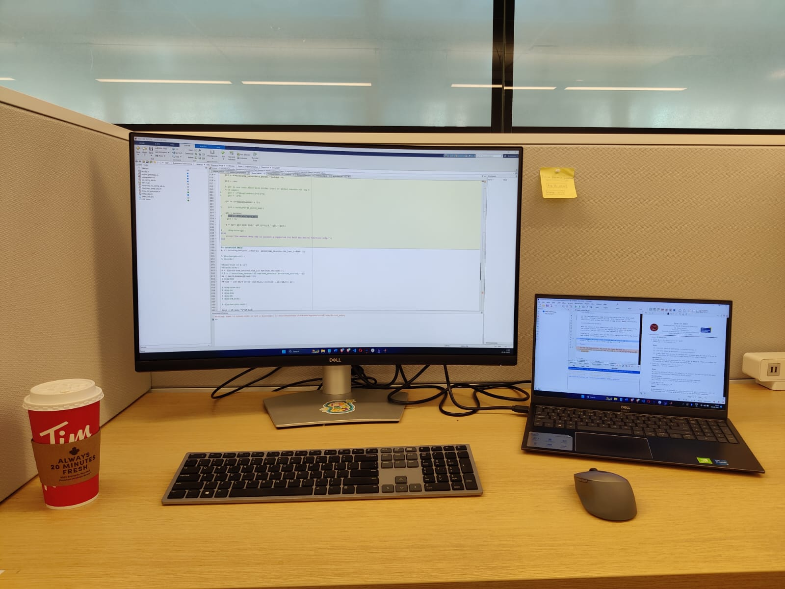

I recently graduated with a Bachelors in Computer Science and Engineering with Honors from the Indian Institute of Information Technology, Sri City (IIIT Sri City) in July 2024. I am a passionate researcher and I love building software solutions. My research interests lie in Computer Vision, Machine Learning (ML), Natural Language Processing and ML Privacy. I currently work as a Machine Learning Engineer at [AutomationEdge Technologies](https://automationedge.com/), where I build Generative AI solutions primarily focused on automating tasks in the healthcare industry and for insurance companies. This strongly aligns with my goals to create machine learning applications that create a positive impact in the real world. I regularly engage in research activities and am actively looking for opportunities to pursue a research-oriented Masters program.

As a part of the Honors program in my Bachelors degree, I have worked as an undergraduate research assistant under the guidance of [Dr. Rakesh Sanodiya](https://www.iiits.ac.in/people/regular-faculty/dr-rakesh-kumar-sanodiya/) (Assistant Professor, IIITS) at the Robotics Lab of IIIT Sri City. During this time, I primarily worked around transfer learning and computer vision. It was a great learning experience and played a key role in building a strong foundation for my future aspirations. I published a paper introducing a new loss function for training domain-agnostic image classification models, improving the average classification accuracy across all tasks.
<!-- , which got 2 citations from articles published at reputed conferences within a year. -->

After my junior year, I was selected for the prestigious Mitacs Globalink Research Internship program. This program connects international students with faculties at Canadian universities and funds them to spend 12 weeks at their host university as a research assistant. I was fortunate to be a part of [Dr. Reza Samavi](https://ee.ryerson.ca/~samavi/)'s (Associate Professor, Toronto Metropolitan University) research group at the Trustworthy AI Lab ( [TAILab ](https://www.ee.ryerson.ca/~samavi/research.html)). There, I worked on the security aspects of ML models, focused on certifying the robustness in multilayer neural networks. This was a completely new perspective to the kind of research I was pursuing before and it really intrigued me. I am still associated with the research group at TAILab as we continue to work on critical security aspects and robustness guarantees of ML models. 

I usually spend my free time playing sports or trekking with my friends. I've been playing football since I was 12 and it's my to-go activity whenever I want to clear my head or relax. Throughout my high school and university, I've been a part of the football team and they're one of the most fulfilling moments that I can recall. Besides sports, I really enjoy watching documentaries about history and major events like the the sinking of the Titanic, the disappearance of the flight MH370 and so on. 

News and Highlights
======
<!--  -->
- **July 2024**: Joined AutomationEdge Technologies as a **Machine Learning Engineer**, after the successful completion of a 6 month internship.
- **June 2024**: Graduated from IIT Sri City with a Bachelors in **Computer Science and Engineering with Honors**.
- **July 2023**: Completed 12 weeks of full-time research at **Trustworthy AI Lab, TMU, Canada**. Couldn't have asked for a more rewarding experience.   

- **July 2023**: Attended <strong><a href="https://vectorinstitute.ai/">Vector Institute</a></strong>'s workshop on Security & Privacy in ML. Met and interacted with <strong>Dr. Nicolas Papernot</strong> and <strong>Dr. Shai Ben-David</strong> - a core memory now!  

- **May 2023**: Landed in Toronto. Had an amazing first day at **TAILab**! 

- **May 2023**: Presented my first **conference paper** at the 5th IEEE Conference on Electronic Systems, Devices and Computing.
