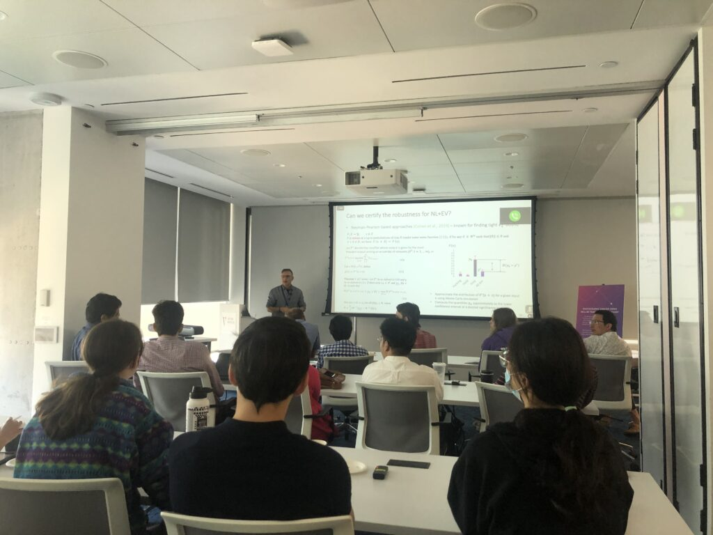

I am currently pursuing a Master’s in Computer Science at the University of Minnesota, Twin Cities, with a focus on machine learning and data-driven applications. I have extensive research and industry experience in building AI solutions, particularly in healthcare. My work spans across Generative AI technology, computer vision, natural language processing, and trustworthy machine learning.

I received my Bachelor’s in Computer Science and Engineering with Honors from IIIT Sri City, where I gained research experience in transfer learning, image classification, and ML model robustness. I was also awarded the MITACS Globalink fellowship (CAN $9,000) which gave me the opportunity to work in-person at Trustworthy AI Lab at Toronto Metropolitan University, Canada. Before starting graduate school, I worked as a Machine Learning Research Engineer at AutomationEdge Technologies, developing generative AI solutions to automate tasks in healthcare, with direct impact on improving the quality of patient care and optimizing intake workflows.

I am always on the lookout for opportunities in data science, machine learning engineering, and backend development. Please feel free to reach out to discuss collaboration on projects or other potential opportunities.

News and Highlights
======
<!--  -->
- **September 2025**: Joined University of Minnesota as an MS Computer Science student. Exciting times ahead!
- **December 2024**: Our paper on **Hate Speech and Target Identification in Devanagari Script Languages** has been accepted at the CHiPSAL workship at the International Conference on Computational Linguistics (COLING) 2025. [arXiv](https://arxiv.org/abs/2412.17131) 
- **July 2024**: Joined AutomationEdge Technologies as a **Machine Learning Research Engineer**, after the successful completion of a 6 month internship.
- **June 2024**: Graduated from IIT Sri City with a Bachelors in **Computer Science and Engineering with Honors**.
- **July 2023**: Completed 12 weeks of full-time research at **Trustworthy AI Lab, TMU, Canada**. Couldn't have asked for a more rewarding experience.   

- **July 2023**: Attended <strong><a href="https://vectorinstitute.ai/">Vector Institute</a></strong>'s workshop on Security & Privacy in ML. Met and interacted with <strong>Dr. Nicolas Papernot</strong> and <strong>Dr. Shai Ben-David</strong> - a core memory now!  

- **May 2023**: Landed in Toronto. Had an amazing first day at **TAILab**! 

- **May 2023**: Presented my first **conference paper** at the 5th IEEE Conference on Electronic Systems, Devices and Computing.
